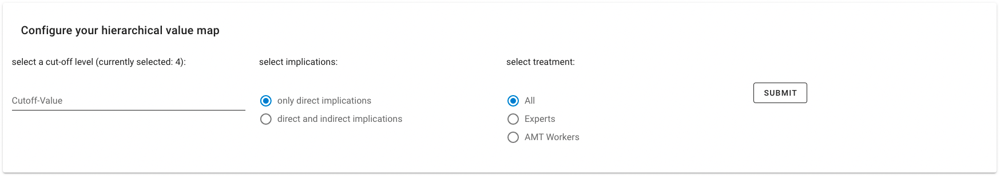

# ladder.ly 

Development of a working prototype for automated aggregation and visualization of laddering interview data

## Installation Backend

* clone the GitHub repo ```TODO: link to out repo```
* navigate to the backend folder
* create venv: ```python -m venv venv```
    * run ```venv\Scripts\activate.bat``` (Windows)
    * or ```source venv/bin/activate``` (Mac/Linux) to activate the virtual environment 
* use [pip](https://pip.pypa.io/en/stable/) to install the requirements: ```pip install -r requirements.txt```
* run app.py to start the BE server


## Installation Frontend

* navigate to the frontend folder
* ```npm install```
* ```npm run serve```   
    * your FE server is now running 


# Documentation
Detailed documentation:

* [Backend](backend/docs/index.html) :
  * [app.py](backend/docs/app.html)
  * [functions.py](backend/docs/functions.html)   
* [Frontend]()
    * [About.vue](frontend/docs/About.md)
    * [Home.vue](frontend/docs/Home.md)
    * [Data.vue]((frontend/docs/Data.md))
    * [Hvm.vue](frontend/docs/Hvm.md)
    * [api/index.js](frontend/docs/ApiIndex.md)
    * [store/index.js](frontend/docs/StoreIndex.md)


## Usage
* start BE server
* start FE server
* open local/network host in your browser
* upload your data 
    * make sure it is in the right format, use example_ladders.xlsx and example_labels-xlsx as template
    * your uploaded data is displayed @/data in a grid layout

____


____

* configure your hierachical value map:
    * cutoff-value
    * only direct, direct and indirect implications, treatment
    * submit to update the hierachical value map

___

___

## Built With

* [flask](https://flask.palletsprojects.com/en/1.1.x/) - Backend
* [vue.js](https://vuejs.org/) - Frontend


## Contributing
Pull requests are welcome. For major changes, please open an issue first to discuss what you would like to change.

## Authors and acknowledgment
The tool has been developed by Jan Bode 

Supervision: Tim Rietz 

@IISM - Karlsruhe Institute of Technology

## License
[MIT](LICENSE.md)
